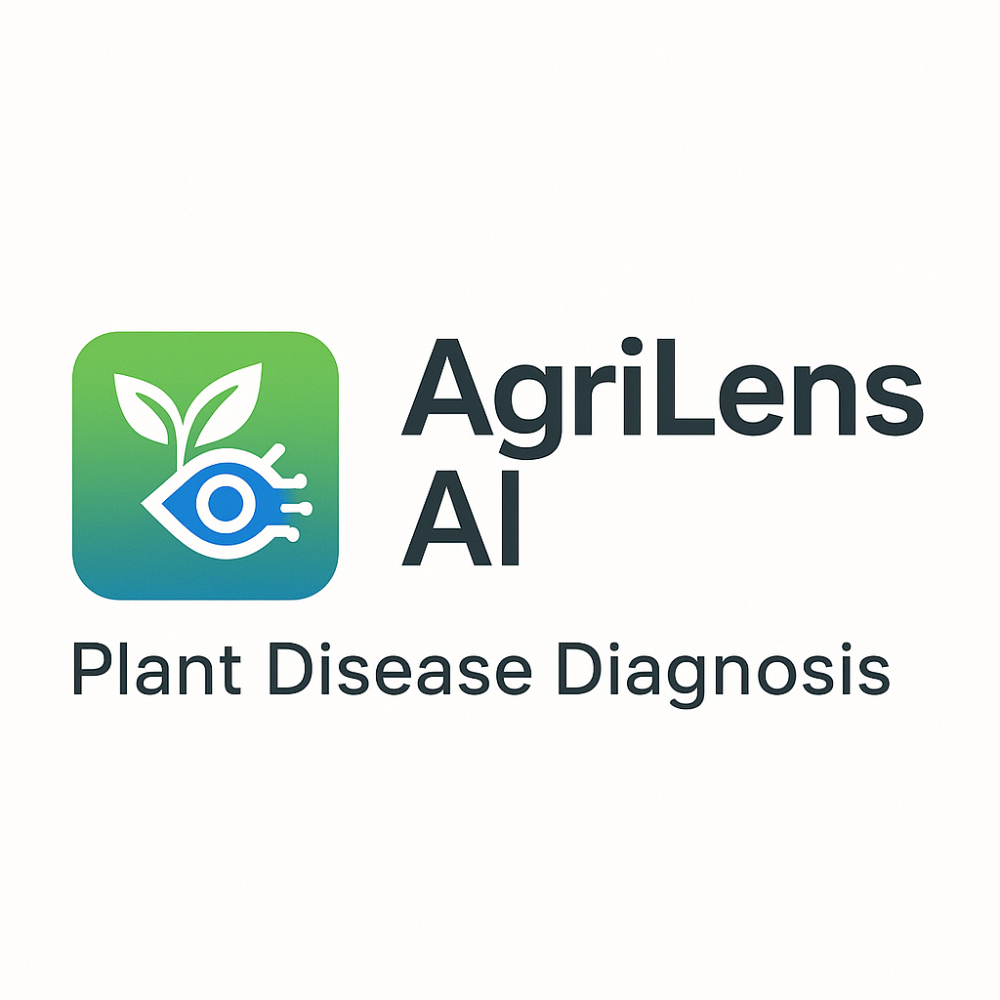

# 🌱 AgriLens AI

**Plant disease diagnosis for farmers using Google's Gemma 3n AI**



[](https://www.python.org/downloads/)
[](https://streamlit.io/)
[](LICENSE)

## What is AgriLens AI?

AgriLens AI helps farmers identify plant diseases instantly using their smartphone camera. No internet needed after setup - works completely offline in the field.

**Key Features:**
- 📸 **Photo Analysis**: Take a photo, get instant diagnosis
- 🌐 **Bilingual**: French and English
- 📱 **Mobile-Friendly**: Works on any smartphone
- 💾 **Offline**: No internet required after initial setup
- 📄 **Export**: Save results as HTML or text

## 🚀 Try It Now

**Live Demo**: [AgriLens AI on Hugging Face](https://huggingface.co/spaces/sido1991/Agrilens_IAv1)

Open the link on your phone - the interface adapts automatically.

## How It Works

1. **Take Photo** of the diseased plant
2. **Specify Crop** (optional but recommended)
3. **Get Diagnosis** with treatment recommendations
4. **Export Results** if needed

## 📸 Examples

### Sample Plant Images
Here are examples of diseased plants you can analyze:

| **Maize Disease** | **Cassava Mosaic** | **Tomato Early Blight** |
|:---:|:---:|:---:|
|  |  |  |

### Demo Screenshots
See what the diagnosis results look like:

| **Interface Overview** | **Image Upload** | **Results Output** | **Mobile Mode** |
|:---:|:---:|:---:|:---:|
|  |  |  |  |

## 🏗️ Architecture


**Technology Stack:**
- **AI Model**: Google Gemma 3n (multimodal)
- **Framework**: Streamlit
- **Languages**: Python, French, English

## 🌾 Real-World Usage

### The "Farm Laptop" Approach

AgriLens AI is designed for **offline use** in rural areas:

1. **Setup in Town**: Download once where internet is available
2. **Deploy to Farm**: Bring laptop to farm - no internet needed
3. **Daily Use**: Farmers take photos, transfer to laptop, get instant diagnosis

### Why This Works

- **70%+ of farmers** have smartphones
- **One laptop** serves entire community
- **No ongoing costs** - completely free
- **Instant results** vs weeks waiting for experts

### Deployment Options

**Option 1: Community Laptop**
- One laptop per village/cooperative
- Shared resource for all farmers
- Setup time: 30 minutes

**Option 2: Extension Workers**
- Technicians carry pre-loaded laptops
- Visit farms with diagnostic capability
- Professional on-site analysis

**Option 3: Individual Setup**
- Farmers with basic tech skills
- Personal diagnostic tool
- Complete independence

## 📊 Comparison

| Feature | AgriLens AI | Traditional Methods |
|---------|-------------|-------------------|
| **Cost** | Free | Expensive consultation |
| **Speed** | Instant | Days/weeks wait |
| **Availability** | 24/7 | Limited expert hours |
| **Language** | French + English | Often language barriers |
| **Internet** | Only for setup | Not required |

## 🛠️ Installation

### Quick Start

```bash
# Clone and setup
git clone https://github.com/Sidoine1991/Agrilens-AI.git
cd AgriLens-AI
pip install -r requirements.txt

# Run (requires internet for first model download)
streamlit run src/streamlit_app_multilingual.py
```

### 📥 Model Download for Offline Use

**Important**: For true offline functionality, you need to download the complete model files locally.

#### Model Information
- **Model**: `google/gemma-3n-E4B-it`
- **Size**: ~10GB+ (complete model files)
- **Location**: Hugging Face Hub

#### Download Methods

**Method 1: Automatic Download (First Run)**
```bash
# The app will download automatically on first run
streamlit run src/streamlit_app_multilingual.py
# This downloads ~10GB to your local cache
```

**Method 2: Manual Download**
```bash
# Download model files manually
python -c "
from transformers import AutoProcessor, AutoModelForCausalLM
model_name = 'google/gemma-3n-E4B-it'
processor = AutoProcessor.from_pretrained(model_name)
model = AutoModelForCausalLM.from_pretrained(model_name)
print('Model downloaded successfully!')
"
```

**Method 3: From Kaggle Notebook**
- Use the [Kaggle Notebook](https://www.kaggle.com/code/sidoineyebadokpo/agrilens-ai?scriptVersionId=253640926)
- Download model files from Kaggle environment
- Transfer to local machine

#### Offline Setup Complete
Once downloaded, the model files are cached locally and the app works completely offline. No internet connection needed for diagnosis.

### Requirements
- Python 3.11+
- 8GB+ RAM (16GB recommended)
- 15GB+ free disk space (for model files)
- Internet connection (first time only)

### Docker

```bash
docker build -t agrilens-ai .
docker run -p 8501:7860 agrilens-ai
```

## 🎯 Performance

- **Response Time**: < 30 seconds
- **Accuracy**: High precision with Gemma 3n
- **Memory**: Adaptive loading for different hardware
- **Supported Plants**: Vegetables, fruits, grains, ornamentals, herbs

## 🔧 Advanced Features

- **Memory Management**: Automatic optimization
- **Error Handling**: Graceful fallbacks
- **Export**: HTML and text reports
- **Mobile Mode**: Simulated offline interface

## 👨‍💻 Creator

**Sidoine Kolaolé YEBADOKPO**
- Location: Bohicon, Republic of Benin
- Email: syebadokpo@gmail.com
- [LinkedIn](https://linkedin.com/in/sidoineko) | [Portfolio](https://huggingface.co/spaces/Sidoineko/portfolio)

## 📄 License

**CC BY 4.0** - Free to use, modify, and distribute with attribution.

## 🔗 Links

- **Demo**: [Hugging Face Spaces](https://huggingface.co/spaces/sido1991/Agrilens_IAv1)
- **Notebook**: [Kaggle](https://www.kaggle.com/code/sidoineyebadokpo/agrilens-ai?scriptVersionId=253640926)
- **Code**: [GitHub](https://github.com/Sidoine1991/Agrilens-AI)

---

*AgriLens AI - Empowering farmers with AI-powered plant disease diagnosis* 🌱

**Version**: 1.0.0 | **Updated**: July 2025 