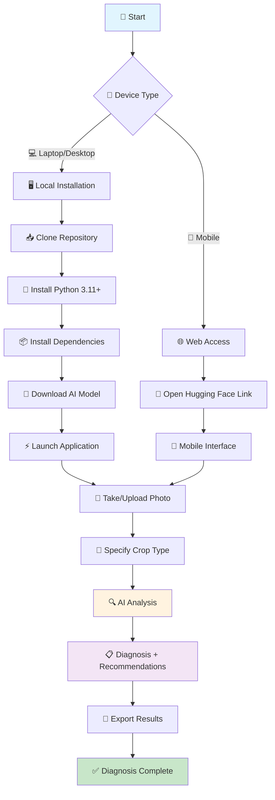

# 🌱 AgriLens AI: Instant Plant Disease Diagnosis

AgriLens AI empowers farmers with immediate plant disease diagnosis using Google's Gemma 3n AI. This innovative solution leverages smartphone cameras to provide accurate diagnoses and treatment recommendations, even in offline environments.

## ✨ Key Features

- **📸 Photo Analysis**: Capture an image of a diseased plant for instant diagnosis.
- **🌐 Bilingual Support**: Available in both French and English for broader accessibility.
- **📱 Mobile-Friendly**: Seamlessly adapts to any smartphone for on-the-go use.
- **💾 Offline Functionality**: Once set up, no internet connection is required for diagnosis, making it ideal for remote areas.
- **📄 Export Options**: Save diagnosis results as HTML or plain text for easy record-keeping and sharing.

## 🚀 Get Started

Experience AgriLens AI directly through our live demo or set it up for offline use.

### Live Demo

Access the live version of AgriLens AI on Hugging Face:

[AgriLens AI on Hugging Face](https://huggingface.co/spaces/sido1991/Agrilens_IAv1)

*Open this link on your smartphone for an optimized mobile experience.*

### How It Works

1.  **Capture**: Take a photo of the affected plant.
2.  **Identify**: Optionally specify the crop type for more precise results.
3.  **Diagnose**: Receive an instant diagnosis along with recommended treatments.
4.  **Save**: Export the results for future reference.

## 🖼️ Visual Examples

See AgriLens AI in action with sample plant images and application screenshots.

### Sample Plant Images

| **Maize Disease** | **Cassava Mosaic** | **Tomato Early Blight** |
|:---:|:---:|:---:|
|  |  |  |

### Demo Screenshots

| **Interface Overview** | **Image Upload** | **Results Output** | **Mobile Mode** |
|:---:|:---:|:---:|:---:|
|  |  |  |  |

## 🏗️ Architecture & Technology Stack

AgriLens AI is built on a robust and efficient architecture:


**Core Technologies:**

-   **AI Model**: Google Gemma 3n (multimodal)
-   **Framework**: Streamlit
-   **Languages**: Python, French, English

## 🌍 Real-World Impact: The "Farm Laptop" Approach

Designed for rural areas with limited internet access, AgriLens AI facilitates offline diagnosis through a unique deployment strategy:

1.  **Initial Setup**: Download the application and model where internet is available (e.g., in town).
2.  **Field Deployment**: Transport the pre-loaded laptop or device to the farm.
3.  **Daily Use**: Farmers capture plant images, transfer them to the device, and receive immediate diagnoses without needing an active internet connection.

### Why This Approach is Effective

-   **Accessibility**: Over 70% of farmers own smartphones, enabling widespread adoption.
-   **Community Resource**: A single laptop can serve an entire community or cooperative.
-   **Cost-Effective**: Eliminates ongoing internet costs, making it a free solution for farmers.
-   **Timely Results**: Provides instant diagnoses, avoiding the weeks-long wait for expert consultations.

### Deployment Options

-   **Community Laptop**: A shared resource for a village or cooperative, set up in approximately 30 minutes.
-   **Extension Workers**: Technicians can carry pre-loaded devices for professional on-site analysis.
-   **Individual Setup**: Farmers with basic technical skills can set up their personal diagnostic tool for complete independence.

## 📊 AgriLens AI vs. Traditional Methods

| Feature | AgriLens AI | Traditional Methods |
|:--------|:------------|:--------------------|
| **Cost** | Free | Expensive consultation |
| **Speed** | Instant | Days/weeks wait |
| **Availability** | 24/7 | Limited expert hours |
| **Language** | French + English | Often language barriers |
| **Internet** | Only for setup | Not required |

## 🔄 Detailed Usage Workflow

Below is a comprehensive flow diagram illustrating the AgriLens AI usage process:



### ⚠️ Important Tips for Uninterrupted Analysis

To ensure accurate and uninterrupted AI model analysis, especially given that the process can take **2-20 minutes** depending on RAM, it is crucial to prevent your device from entering sleep mode.

#### On Laptop/Desktop:

-   **Disable Sleep Mode**: Adjust system settings to prevent automatic sleep.
-   **Increase Sleep Delay**: Set the sleep delay to at least 10 minutes.
-   **Disable Screen Saver**: Turn off any active screen savers during use.
-   **Maintain Power**: Keep your device connected to a power source if possible.

#### On Mobile:

-   **Increase Screen Brightness**: Ensure visibility during the analysis.
-   **Disable Auto-Rotation**: Prevent screen orientation changes.
-   **Close Other Applications**: Free up memory and processing power.
-   **Use "Do Not Disturb" Mode**: Avoid interruptions from notifications.

*Patience is key; do not interrupt the process even if it appears slow.*

## 🛠️ Installation Guide

Follow these steps to set up AgriLens AI on your local machine.

### Quick Start

```bash
# Clone the repository and navigate into the directory
git clone https://github.com/Sidoine1991/Agrilens-AI.git
cd AgriLens-AI

# Install required Python dependencies
pip install -r requirements.txt

# Run the Streamlit application (requires internet for first model download)
streamlit run src/streamlit_app_multilingual.py
```

### 📥 Model Download for Offline Use

For complete offline functionality, the Google Gemma 3n AI model (~10GB+) must be downloaded locally. This is a **one-time critical setup process** requiring a stable internet connection.

#### Step-by-Step Download Process:

1.  **Create Hugging Face Account**: Sign up and verify your email at [Hugging Face](https://huggingface.co/join). This is mandatory for model access.
2.  **Access the Model**: Visit `https://huggingface.co/google/gemma-3n-E4B-it` and accept the terms and conditions to gain download permissions.
3.  **Download Model Files**: Download all complete model files (~10GB). Ensure a stable internet connection; if the download fails, you must restart.
4.  **Organize Files**: Create a folder named `model_gemma` and place all downloaded files within it. Update the `LOCAL_MODEL_PATH` in your code (e.g., `LOCAL_MODEL_PATH = "D:/Dev/model_gemma"`).

#### ⚠️ Critical Requirements for Model Download:

-   **Stable Internet**: A reliable connection is essential for the 10GB download.
-   **Sufficient Storage**: Recommend 15GB+ free disk space.
-   **Patience**: The download may take 30-60 minutes depending on your connection speed.
-   **No Interruption**: Avoid system sleep or network disconnections during the download.

#### Demo vs. Local Offline Setup

| Feature | Hugging Face Demo | Local Offline Setup |
|:--------|:------------------|:--------------------|
| **Internet** | Required | Only for initial download |
| **Speed** | Depends on server | Instant local processing |
| **Reliability** | Subject to outages | Always available |
| **Setup Time** | Instant | 30-60 minutes one-time |
| **Model Access** | Pre-loaded | Downloaded locally |

#### 🔄 Alternative Download: Kaggle Notebook

If you encounter issues with Hugging Face direct download, you can use our [Kaggle Notebook](https://www.kaggle.com/code/sidoineyebadokpo/agrilens-ai) to download the model and then transfer the files to your local `model_gemma` folder.

#### 🎮 GPU Acceleration Benefits

Users with NVIDIA/AMD GPUs will experience significantly faster performance:

-   **GPU Users**: Achieve 3-5x faster diagnosis compared to CPU-only systems.
-   **CUDA Support**: Automatic GPU detection and utilization for optimized performance.
-   **Memory Efficiency**: GPU VRAM reduces overall system RAM usage.
-   **Real-time Processing**: Near-instant results on high-end GPUs.

#### Model Download Methods

1.  **Automatic Download (First Run)**:
    ```bash
    streamlit run src/streamlit_app_multilingual.py
    # The application will automatically download ~10GB to your local cache on its first run.
    ```
2.  **Manual Download (Python Script)**:
    ```bash
    python -c "\
    from transformers import AutoProcessor, AutoModelForCausalLM\
    model_name = 'google/gemma-3n-E4B-it'\
    processor = AutoProcessor.from_pretrained(model_name)\
    model = AutoModelForCausalLM.from_pretrained(model_name)\
    print('Model downloaded successfully!')\
    "
    ```
3.  **From Kaggle Notebook**:
    -   Utilize the [Kaggle Notebook](https://www.kaggle.com/code/sidoineyebadokpo/agrilens-ai?scriptVersionId=253640926) to download model files.
    -   Transfer the downloaded files to your local machine.

*Once downloaded, the model files are cached locally, enabling the app to work completely offline for diagnosis.*

## 🌱 Configuration du Modèle Local

Ce guide explique comment configurer AgriLens AI pour utiliser un modèle Gemma local au lieu de télécharger depuis Hugging Face.

### 📋 Prérequis

- Python 3.8+
- Modèle Gemma 3n E4B IT téléchargé localement
- Espace disque suffisant (environ 4-8 GB selon la version)

### 🚀 Installation du Modèle Local

#### Option A: Téléchargement Manuel depuis Hugging Face

1. **Accédez à la page du modèle** : [google/gemma-3n-e2b-it](https://huggingface.co/google/gemma-3n-e2b-it)
2. **Acceptez les conditions d'utilisation** (si nécessaire)
3. **Téléchargez les fichiers** :
   - `config.json`
   - `tokenizer.json`
   - `tokenizer_config.json`
   - `model.safetensors` (ou fichiers `.bin`)
   - `generation_config.json`
   - `special_tokens_map.json`

#### Option B: Téléchargement Automatique

```bash
# Installer huggingface-hub
pip install huggingface-hub

# Télécharger le modèle
huggingface-cli download google/gemma-3n-e2b-it --local-dir D:/Dev/model_gemma
```

#### Organisation des Fichiers

Créez le dossier `D:/Dev/model_gemma` et placez-y tous les fichiers téléchargés :

```
D:/Dev/model_gemma/
├── config.json
├── tokenizer.json
├── tokenizer_config.json
├── model.safetensors
├── generation_config.json
└── special_tokens_map.json
```

#### Vérification de l'Installation

Exécutez le script de test pour vérifier la configuration :

```bash
python test_local_model.py
```

Vous devriez voir :
```
✅ Dossier trouvé : D:/Dev/model_gemma
✅ config.json
✅ tokenizer.json
✅ tokenizer_config.json
📦 Fichiers de poids trouvés : 1
   - model.safetensors
💾 Taille totale : 4.23 GB
```

### ⚙️ Configuration dans AgriLens AI

#### Lancement de l'Application

```bash
cd AgriLensAI
streamlit run src/streamlit_app_multilingual.py
```

#### Configuration via l'Interface

1. **Ouvrez la sidebar** (⚙️ Réglages)
2. **Vérifiez le statut du modèle local** :
   - ✅ Modèle local valide : D:/Dev/model_gemma
   - 📁 Modèle complet trouvé (6 fichiers)

3. **Modifiez le chemin si nécessaire** :
   - Dans la section "📁 Configuration du modèle local"
   - Entrez le chemin vers votre dossier de modèle

4. **Chargez le modèle** :
   - Cliquez sur "Charger le Modèle IA"
   - Le modèle se chargera depuis le dossier local

#### Vérification du Mode Local

L'application affichera :
- 🔄 Chargement du modèle local : D:/Dev/model_gemma
- ✅ Modèle local chargé avec succès

### 🔧 Dépannage

#### Problème : "Dossier non trouvé"

**Solution** :
- Vérifiez que le chemin `D:/Dev/model_gemma` existe
- Utilisez des slashes forward (/) ou double backslashes (\\\\) dans le chemin
- Vérifiez les permissions d'accès au dossier

#### Problème : "Fichiers manquants"

**Solution** :
- Assurez-vous que tous les fichiers requis sont présents
- Re-téléchargez le modèle si nécessaire
- Vérifiez que les fichiers ne sont pas corrompus

#### Problème : "Aucun fichier de poids du modèle trouvé"

**Solution** :
- Vérifiez que le fichier `model.safetensors` ou les fichiers `.bin` sont présents
- Le fichier de poids peut faire plusieurs GB

#### Problème : "Erreur de mémoire"

**Solution** :
- Fermez d'autres applications
- Utilisez la quantisation 4-bit ou 8-bit
- Chargez le modèle sur CPU si la GPU n'a pas assez de mémoire

### 📊 Avantages du Mode Local

#### ✅ Avantages
- **Pas de téléchargement** : Le modèle est déjà disponible
- **Fonctionnement hors ligne** : Aucune connexion internet requise
- **Performance** : Chargement plus rapide après la première fois
- **Contrôle** : Vous maîtrisez la version du modèle utilisée
- **Économie** : Pas de consommation de bande passante

#### ⚠️ Inconvénients
- **Espace disque** : Le modèle occupe plusieurs GB
- **Mise à jour** : Nécessite un téléchargement manuel pour les nouvelles versions
- **Configuration** : Nécessite une configuration initiale

### 🔄 Mise à Jour du Modèle

Pour mettre à jour le modèle local :

1. **Sauvegardez l'ancien modèle** (optionnel)
2. **Téléchargez la nouvelle version** depuis Hugging Face
3. **Remplacez les fichiers** dans le dossier `D:/Dev/model_gemma`
4. **Rechargez le modèle** dans l'application

### 📝 Notes Techniques

#### Structure des Fichiers

Le modèle Gemma 3n E4B IT contient :
- **Configuration** : `config.json` - Paramètres du modèle
- **Tokenisation** : `tokenizer.json`, `tokenizer_config.json` - Gestion du texte
- **Poids** : `model.safetensors` - Paramètres entraînés du modèle
- **Génération** : `generation_config.json` - Paramètres de génération

#### Formats Supportés

L'application supporte :
- **Safetensors** : Format recommandé (plus sûr et plus rapide)
- **PyTorch** : Fichiers `.bin` (format classique)
- **GGUF** : Format optimisé pour certains cas d'usage

#### Optimisations

Pour de meilleures performances :
- **GPU** : Utilisez une GPU avec au moins 8GB de VRAM
- **Quantisation** : Utilisez 4-bit ou 8-bit pour réduire l'empreinte mémoire
- **Cache** : L'application met en cache le modèle pour les utilisations suivantes

### 🆘 Support

Si vous rencontrez des problèmes :

1. **Vérifiez la configuration** avec `test_local_model.py`
2. **Consultez les logs** de l'application Streamlit
3. **Vérifiez les dépendances** : `pip list | grep transformers`
4. **Contactez le support** : syebadokpo@gmail.com

### System Requirements

-   **Python**: 3.11+
-   **RAM**: 8GB+ (16GB recommended)
-   **Disk Space**: 15GB+ free (for model files)
-   **Internet**: Required only for the initial setup and model download.

### Docker Installation

For containerized deployment:

```bash
docker build -t agrilens-ai .
docker run -p 8501:7860 agrilens-ai
```

## 🎯 Performance Overview

AgriLens AI's performance has been significantly optimized with multiple performance modes and advanced techniques for faster response times.

### ⚡ Performance Modes

AgriLens AI now features three configurable performance modes to suit different needs:

| Mode | Response Time | Memory Usage | Quality | Best For |
|:-----|:--------------|:-------------|:--------|:---------|
| **🚀 FAST** | 10-30 seconds | ~2-4 GB | Good | Quick diagnostics, testing |
| **⚖️ BALANCED** | 20-60 seconds | ~3-6 GB | Excellent | Daily use, most cases |
| **🎯 QUALITY** | 30-90 seconds | ~4-8 GB | Maximum | Detailed analysis |

### Response Time by Hardware Configuration

| Hardware Configuration | FAST Mode | BALANCED Mode | QUALITY Mode | Notes |
|:-----------------------|:----------|:--------------|:-------------|:------|
| **GPU + 16GB+ RAM** | < 10s | < 20s | < 30s | **Optimal performance** |
| **GPU + 8-12GB RAM** | 10-20s | 20-40s | 30-60s | **Excellent performance** |
| **16GB+ RAM (CPU only)** | 20-40s | 40-80s | 60-120s | Good performance |
| **8-12GB RAM (CPU only)** | 30-60s | 60-120s | 90-180s | Acceptable performance |
| **4-8GB RAM (CPU only)** | 60-120s | 120-240s | 180-300s | Slow performance |

### 🚀 Performance Optimizations

#### Advanced 4-bit Quantization
- **75% memory reduction** compared to standard loading
- **Double quantization** for better stability
- **NormalFloat4** format for quality preservation

#### Flash Attention 2
- **2-4x faster** attention computation
- **Automatic fallback** if not available
- **Significant memory savings**

#### Optimized Generation Parameters
- **Reduced token generation** (300-500 vs 520)
- **Top-K sampling** for faster token selection
- **Cache optimization** for repeated computations

### ⚠️ Important Performance Notes

-   **Performance Mode**: Select the appropriate mode in the sidebar settings
-   **GPU Advantage**: NVIDIA/AMD GPUs provide 3-5x speed increase
-   **Memory Management**: 4-bit quantization reduces memory usage by 75%
-   **First Run**: Initial model loading may take longer
-   **Background Processes**: Close other applications to free up RAM
-   **No Interruption**: Avoid closing during analysis

### Accuracy & Capabilities

-   **Accuracy**: High precision in diagnosis, powered by Gemma 3n.
-   **Memory**: Adaptive loading optimizes memory usage for various hardware configurations.
-   **Supported Plants**: Comprehensive coverage including vegetables, fruits, grains, ornamentals, and herbs.

## 🔧 Advanced Features

-   **Memory Management**: Automatic optimization for efficient resource utilization.
-   **Error Handling**: Robust graceful fallbacks ensure application stability.
-   **Export**: Generate detailed HTML and text reports of diagnosis results.
-   **Mobile Mode**: A simulated offline interface designed for seamless mobile use.

## 🚀 Nouvelles Fonctionnalités

### 📊 Barre de Progression Intelligente
- **Progression en temps réel** : Affichage d'une barre de progression avec pourcentage d'avancement
- **Estimation du temps** : Calcul intelligent du temps restant basé sur le mode de performance et le type d'analyse
- **Statuts détaillés** : Messages informatifs sur chaque étape de l'analyse
- **Adaptation automatique** : Ajustement des estimations selon les performances du système (GPU/CPU)

### 🎯 Réponses Structurées et Succinctes
- **Format standardisé** : Toutes les analyses génèrent des réponses avec 3 sections obligatoires :
  1. **SYMPTÔMES VISIBLES** (description courte)
  2. **NOM DE LA MALADIE** (avec niveau de confiance %)
  3. **TRAITEMENT RECOMMANDÉ** (actions concrètes)
- **Limitation de mots** : Maximum 200 mots pour l'analyse d'image, 150 mots pour l'analyse de texte
- **Optimisation des tokens** : Réduction des `max_new_tokens` pour éviter la troncature (250-350 tokens)

### ⚡ Optimisations de Performance
- **Modes de performance ajustés** :
  - **Rapide** : 250 tokens, ~10-30 secondes
  - **Équilibré** : 300 tokens, ~20-60 secondes  
  - **Qualité** : 350 tokens, ~30-90 secondes
- **Prompts optimisés** : Instructions claires et concises pour des réponses plus précises
- **Gestion de la mémoire** : Nettoyage automatique après chaque analyse

## 👨‍💻 Creator

**Sidoine Kolaolé YEBADOKPO**

-   **Location**: Bohicon, Republic of Benin
-   **Email**: syebadokpo@gmail.com
-   [LinkedIn Profile](https://linkedin.com/in/sidoineko)
-   [Portfolio](https://huggingface.co/spaces/Sidoineko/portfolio)

## 📄 License

This project is licensed under **CC BY 4.0**.

*You are free to use, modify, and distribute this software with attribution.*

## 🔗 Useful Links

-   **Live Demo**: [Hugging Face Spaces](https://huggingface.co/spaces/sido1991/Agrilens_IAv1)
-   **Kaggle Notebook**: [Kaggle](https://www.kaggle.com/code/sidoineyebadokpo/agrilens-ai?scriptVersionId=253640926)
-   **Source Code**: [GitHub](https://github.com/Sidoine1991/Agrilens-AI)

---

*AgriLens AI: Empowering farmers with AI-powered plant disease diagnosis* 🌱

**Version**: 1.0.0 | **Last Updated**: July 2025 