```mermaid
flowchart TD
    A[🚀 Start] --> B{📱 Device Type}
    B -->|💻 Laptop/Desktop| C[🖥️ Local Installation]
    B -->|📱 Mobile| D[🌐 Web Access]
    
    C --> E[📥 Clone Repository]
    E --> F[🐍 Install Python 3.11+]
    F --> G[📦 Install Dependencies]
    G --> H[🤖 Download AI Model]
    H --> I[⚡ Launch Application]
    
    D --> J[🔗 Open Hugging Face Link]
    J --> K[📱 Mobile Interface]
    
    I --> L[📸 Take/Upload Photo]
    K --> L
    L --> M[🌾 Specify Crop Type]
    M --> N[🔍 AI Analysis]
    N --> O[📋 Diagnosis + Recommendations]
    O --> P[💾 Export Results]
    P --> Q[✅ Diagnosis Complete]
    
    style A fill:#e1f5fe
    style Q fill:#c8e6c9
    style N fill:#fff3e0
    style O fill:#f3e5f5
```

# 🌱 AgriLens AI: Instant Plant Disease Diagnosis

AgriLens AI empowers farmers with immediate plant disease diagnosis using Google's Gemma 3n AI. This innovative solution leverages smartphone cameras to provide accurate diagnoses and treatment recommendations, even in offline environments.

## ✨ Key Features

- **📸 Photo Analysis**: Capture an image of a diseased plant for instant diagnosis.
- **🌐 Bilingual Support**: Available in both French and English for broader accessibility.
- **📱 Mobile-Friendly**: Seamlessly adapts to any smartphone for on-the-go use.
- **💾 Offline Functionality**: Once set up, no internet connection is required for diagnosis, making it ideal for remote areas.
- **📄 Export Options**: Save diagnosis results as HTML or plain text for easy record-keeping and sharing.
- **🎯 Refined Diagnosis**: Advanced user input integration for more accurate results.
- **📍 Location Awareness**: GPS coordinates or manual location input for regional context.
- **🌾 Agronomic Variables**: Soil type, plant age, planting density, and more for precise diagnosis.
- **🌤️ Climatic Variables**: Temperature, humidity, precipitation, and seasonal factors.
- **📊 Progress Tracking**: Real-time progress bar with estimated completion time.
- **🔧 Performance Optimization**: 4-bit quantization, Flash Attention 2, and adaptive loading strategies.

## 🚀 Get Started

Experience AgriLens AI directly through our live demo or set it up for offline use.

### Live Demo

Access the live version of AgriLens AI on Hugging Face:

[AgriLens AI on Hugging Face](https://huggingface.co/spaces/sido1991/Agrilens_IAv1)

*Open this link on your smartphone for an optimized mobile experience.*

### How It Works

1.  **Capture**: Take a photo of the affected plant.
2.  **Identify**: Optionally specify the crop type for more precise results.
3.  **Enhance**: Add agronomic and climatic variables for refined diagnosis.
4.  **Locate**: Provide GPS coordinates or location details for regional context.
5.  **Diagnose**: Receive an instant diagnosis along with recommended treatments.
6.  **Save**: Export the results for future reference.

## 🎯 Advanced User Input Integration

AgriLens AI now supports comprehensive user input integration for more accurate and contextual diagnoses:

### 🌾 Agronomic Variables
Users can specify detailed agricultural parameters to refine the diagnosis:
- **Soil Type**: Clay, sandy, loamy, or mixed soil types
- **Plant Age**: Growth stage and maturity level
- **Planting Density**: Spacing and population density
- **Irrigation**: Watering frequency and method
- **Fertilization**: Nutrient application and timing
- **Crop Rotation**: Previous crops and rotation patterns

### 🌤️ Climatic Variables
Environmental factors that influence disease development:
- **Temperature**: Current and recent temperature ranges
- **Humidity**: Relative humidity levels
- **Precipitation**: Rainfall patterns and frequency
- **Season**: Current growing season
- **Sun Exposure**: Direct or partial sunlight exposure
- **Wind Conditions**: Air circulation and wind patterns

### 📍 Location Awareness
Geographic context for regional disease patterns:
- **GPS Coordinates**: Automatic GPS capture or manual input
- **Country/Region**: Geographic location for climate context
- **City/Locality**: Local environmental conditions
- **Altitude**: Elevation above sea level

### 🔄 Integrated Analysis Process
All user inputs are intelligently combined with image analysis:
1. **Image Processing**: Visual symptom identification
2. **Context Integration**: User-provided variables are merged into a single refined request
3. **Regional Adaptation**: Location-specific disease patterns are considered
4. **Structured Output**: Results include symptoms, disease name, and recommended treatment

## 🖼️ Visual Examples

See AgriLens AI in action with sample plant images and application screenshots.

### Sample Plant Images

| **Maize Disease** | **Cassava Mosaic** | **Tomato Early Blight** |
|:---:|:---:|:---:|
|  |  |  |

### Demo Screenshots

| **Interface Overview** | **Image Upload** | **Results Output** | **Mobile Mode** |
|:---:|:---:|:---:|:---:|
|  |  |  |  |

## 🏗️ Architecture & Technology Stack

AgriLens AI is built on a robust and efficient architecture:


**Core Technologies:**

-   **AI Model**: Google Gemma 3n (multimodal)
-   **Framework**: Streamlit
-   **Languages**: Python, French, English

## 🌍 Real-World Impact: The "Farm Laptop" Approach

Designed for rural areas with limited internet access, AgriLens AI facilitates offline diagnosis through a unique deployment strategy:

1.  **Initial Setup**: Download the application and model where internet is available (e.g., in town).
2.  **Field Deployment**: Transport the pre-loaded laptop or device to the farm.
3.  **Daily Use**: Farmers capture plant images, transfer them to the device, and receive immediate diagnoses without needing an active internet connection.

### Why This Approach is Effective

-   **Accessibility**: Over 70% of farmers own smartphones, enabling widespread adoption.
-   **Community Resource**: A single laptop can serve an entire community or cooperative.
-   **Cost-Effective**: Eliminates ongoing internet costs, making it a free solution for farmers.
-   **Timely Results**: Provides instant diagnoses, avoiding the weeks-long wait for expert consultations.

### Deployment Options

-   **Community Laptop**: A shared resource for a village or cooperative, set up in approximately 30 minutes.
-   **Extension Workers**: Technicians can carry pre-loaded devices for professional on-site analysis.
-   **Individual Setup**: Farmers with basic technical skills can set up their personal diagnostic tool for complete independence.

## 📊 AgriLens AI vs. Traditional Methods

| Feature | AgriLens AI | Traditional Methods |
|:--------|:------------|:--------------------|
| **Cost** | Free | Expensive consultation |
| **Speed** | Instant | Days/weeks wait |
| **Availability** | 24/7 | Limited expert hours |
| **Language** | French + English | Often language barriers |
| **Internet** | Only for setup | Not required |

## 🔄 Detailed Usage Workflow

Below is a comprehensive flow diagram illustrating the AgriLens AI usage process:



### ⚠️ Important Tips for Uninterrupted Analysis

To ensure accurate and uninterrupted AI model analysis, especially given that the process can take **2-20 minutes** depending on RAM, it is crucial to prevent your device from entering sleep mode.

#### On Laptop/Desktop:

-   **Disable Sleep Mode**: Adjust system settings to prevent automatic sleep.
-   **Increase Sleep Delay**: Set the sleep delay to at least 10 minutes.
-   **Disable Screen Saver**: Turn off any active screen savers during use.
-   **Maintain Power**: Keep your device connected to a power source if possible.

#### On Mobile:

-   **Increase Screen Brightness**: Ensure visibility during the analysis.
-   **Disable Auto-Rotation**: Prevent screen orientation changes.
-   **Close Other Applications**: Free up memory and processing power.
-   **Use "Do Not Disturb" Mode**: Avoid interruptions from notifications.

*Patience is key; do not interrupt the process even if it appears slow.*

## 🛠️ Installation Guide

Follow these steps to set up AgriLens AI on your local machine.

### Quick Start

```bash
# Clone the repository and navigate into the directory
git clone https://github.com/Sidoine1991/Agrilens-AI.git
cd AgriLens-AI

# Install required Python dependencies
pip install -r requirements.txt

# Run the Streamlit application (requires internet for first model download)
streamlit run src/streamlit_app_multilingual.py
```

### 📥 Model Download for Offline Use

For complete offline functionality, the Google Gemma 3n AI model (~10GB+) must be downloaded locally. This is a **one-time critical setup process** requiring a stable internet connection.

#### Step-by-Step Download Process:

1.  **Create Hugging Face Account**: Sign up and verify your email at [Hugging Face](https://huggingface.co/join). This is mandatory for model access.
2.  **Access the Model**: Visit `https://huggingface.co/google/gemma-3n-E4B-it` and accept the terms and conditions to gain download permissions.
3.  **Download Model Files**: Download all complete model files (~10GB). Ensure a stable internet connection; if the download fails, you must restart.
4.  **Organize Files**: Create a folder named `model_gemma` and place all downloaded files within it. Update the `LOCAL_MODEL_PATH` in your code (e.g., `LOCAL_MODEL_PATH = "D:/Dev/model_gemma"`).

#### ⚠️ Critical Requirements for Model Download:

-   **Stable Internet**: A reliable connection is essential for the 10GB download.
-   **Sufficient Storage**: Recommend 15GB+ free disk space.
-   **Patience**: The download may take 30-60 minutes depending on your connection speed.
-   **No Interruption**: Avoid system sleep or network disconnections during the download.

#### Demo vs. Local Offline Setup

| Feature | Hugging Face Demo | Local Offline Setup |
|:--------|:------------------|:--------------------|
| **Internet** | Required | Only for initial download |
| **Speed** | Depends on server | Instant local processing |
| **Reliability** | Subject to outages | Always available |
| **Setup Time** | Instant | 30-60 minutes one-time |
| **Model Access** | Pre-loaded | Downloaded locally |

#### 🔄 Alternative Download: Kaggle Notebook

If you encounter issues with Hugging Face direct download, you can use our [Kaggle Notebook](https://www.kaggle.com/code/sidoineyebadokpo/agrilens-ai) to download the model and then transfer the files to your local `model_gemma` folder.

#### 🎮 GPU Acceleration Benefits

Users with NVIDIA/AMD GPUs will experience significantly faster performance:

-   **GPU Users**: Achieve 3-5x faster diagnosis compared to CPU-only systems.
-   **CUDA Support**: Automatic GPU detection and utilization for optimized performance.
-   **Memory Efficiency**: GPU VRAM reduces overall system RAM usage.
-   **Real-time Processing**: Near-instant results on high-end GPUs.

#### Model Download Methods

1.  **Automatic Download (First Run)**:
    ```bash
    streamlit run src/streamlit_app_multilingual.py
    # The application will automatically download ~10GB to your local cache on its first run.
    ```
2.  **Manual Download (Python Script)**:
    ```bash
    python -c "\
    from transformers import AutoProcessor, AutoModelForCausalLM\
    model_name = 'google/gemma-3n-E4B-it'\
    processor = AutoProcessor.from_pretrained(model_name)\
    model = AutoModelForCausalLM.from_pretrained(model_name)\
    print('Model downloaded successfully!')\
    "
    ```
3.  **From Kaggle Notebook**:
    -   Utilize the [Kaggle Notebook](https://www.kaggle.com/code/sidoineyebadokpo/agrilens-ai?scriptVersionId=253640926) to download model files.
    -   Transfer the downloaded files to your local machine.

*Once downloaded, the model files are cached locally, enabling the app to work completely offline for diagnosis.*

### System Requirements

-   **Python**: 3.11+
-   **RAM**: 8GB+ (16GB recommended)
-   **Disk Space**: 15GB+ free (for model files)
-   **Internet**: Required only for the initial setup and model download.

### Docker Installation

For containerized deployment:

```bash
docker build -t agrilens-ai .
docker run -p 8501:7860 agrilens-ai
```

## 🎯 Performance Overview

AgriLens AI's performance varies based on hardware configuration, with GPU acceleration providing significant speed improvements.

### Response Time by Hardware Configuration

| Hardware Configuration | Expected Response Time | Notes |
|:-----------------------|:-----------------------|:------|
| **GPU + 16GB+ RAM** | < 10 seconds | **Optimal performance** |
| **GPU + 8-12GB RAM** | 15-30 seconds | **Excellent performance** |
| **16GB+ RAM (CPU only)** | < 30 seconds | Good performance |
| **8-12GB RAM (CPU only)** | 1-3 minutes | Acceptable performance |
| **4-8GB RAM (CPU only)** | 5-10 minutes | Slow performance |
| **< 4GB RAM (CPU only)** | 10-20 minutes | **Maximum wait time** |

### ⚠️ Important Performance Notes

-   **GPU Advantage**: NVIDIA/AMD GPUs provide a 3-5x speed increase in diagnosis time.
-   **RAM is Critical**: The AI model demands substantial memory for efficient processing.
-   **First Run**: Initial model loading may take longer across all systems.
-   **Background Processes**: Close other applications to free up RAM and improve performance.
-   **Patience Required**: On devices with lower RAM, the diagnostic process can extend up to 20 minutes.
-   **No Interruption**: Avoid closing the application during analysis, even if it seems to be slow.

### Accuracy & Capabilities

-   **Accuracy**: High precision in diagnosis, powered by Gemma 3n.
-   **Memory**: Adaptive loading optimizes memory usage for various hardware configurations.
-   **Supported Plants**: Comprehensive coverage including vegetables, fruits, grains, ornamentals, and herbs.

## 🔧 Advanced Features

-   **Memory Management**: Automatic optimization for efficient resource utilization.
-   **Error Handling**: Robust graceful fallbacks ensure application stability.
-   **Export**: Generate detailed HTML and text reports of diagnosis results.
-   **Mobile Mode**: A simulated offline interface designed for seamless mobile use.
-   **Progress Tracking**: Real-time progress bar with estimated completion time.
-   **Structured Output**: Enforced three-section format (symptoms, disease name, treatment).
-   **Context-Aware Analysis**: Integration of multiple user inputs for refined diagnosis.
-   **Performance Optimization**: 4-bit quantization, Flash Attention 2, and adaptive loading.
-   **Local Model Support**: Complete offline functionality with local model loading.
-   **Multimodal Processing**: Advanced image and text processing with Gemma 3n.

## 👨‍💻 Creator

**Sidoine Kolaolé YEBADOKPO**

-   **Location**: Bohicon, Republic of Benin
-   **Email**: syebadokpo@gmail.com
-   [LinkedIn Profile](https://linkedin.com/in/sidoineko)
-   [Portfolio](https://huggingface.co/spaces/Sidoineko/portfolio)

## 📄 License

This project is licensed under **CC BY 4.0**.

*You are free to use, modify, and distribute this software with attribution.*

## 🔗 Useful Links

-   **Live Demo**: [Hugging Face Spaces](https://huggingface.co/spaces/sido1991/Agrilens_IAv1)
-   **Kaggle Notebook**: [Kaggle](https://www.kaggle.com/code/sidoineyebadokpo/agrilens-ai?scriptVersionId=253640926)
-   **Source Code**: [GitHub](https://github.com/Sidoine1991/Agrilens-AI)

---

*AgriLens AI: Empowering farmers with AI-powered plant disease diagnosis* 🌱

---
title: AgriLens AI - Plant Disease Diagnosis
emoji: 🌱
colorFrom: green
colorTo: yellow
sdk: docker
sdk_version: "1.0.0"
app_file: src/streamlit_app_multilingual.py
pinned: false
license: mit
---

# 🌱 AgriLens AI: Instant Plant Disease Diagnosis

AgriLens AI empowers farmers with immediate plant disease diagnosis using Google's Gemma 3n AI. This innovative solution leverages smartphone cameras to provide accurate diagnoses and treatment recommendations, even in offline environments.

## ✨ Key Features

- **📸 Photo Analysis**: Capture an image of a diseased plant for instant diagnosis.
- **🌐 Bilingual Support**: Available in both French and English for broader accessibility.
- **📱 Mobile-Friendly**: Seamlessly adapts to any smartphone for on-the-go use.
- **💾 Offline Functionality**: Once set up, no internet connection is required for diagnosis, making it ideal for remote areas.
- **📄 Export Options**: Save diagnosis results as HTML or plain text for easy record-keeping and sharing.
- **🎯 Refined Diagnosis**: Advanced user input integration for more accurate results.
- **📍 Location Awareness**: GPS coordinates or manual location input for regional context.
- **🌾 Agronomic Variables**: Soil type, plant age, planting density, and more for precise diagnosis.
- **🌤️ Climatic Variables**: Temperature, humidity, precipitation, and seasonal factors.
- **📊 Progress Tracking**: Real-time progress bar with estimated completion time.
- **🔧 Performance Optimization**: 4-bit quantization, Flash Attention 2, and adaptive loading strategies.

## 🚀 Get Started

Experience AgriLens AI directly through our live demo or set it up for offline use.

### Live Demo

Access the live version of AgriLens AI on Hugging Face:

[AgriLens AI on Hugging Face](https://huggingface.co/spaces/sido1991/Agrilens_IAv1)

*Open this link on your smartphone for an optimized mobile experience.*

### How It Works

1.  **Capture**: Take a photo of the affected plant.
2.  **Identify**: Optionally specify the crop type for more precise results.
3.  **Enhance**: Add agronomic and climatic variables for refined diagnosis.
4.  **Locate**: Provide GPS coordinates or location details for regional context.
5.  **Diagnose**: Receive an instant diagnosis along with recommended treatments.
6.  **Save**: Export the results for future reference.

## 🎯 Advanced User Input Integration

AgriLens AI now supports comprehensive user input integration for more accurate and contextual diagnoses:

### 🌾 Agronomic Variables
Users can specify detailed agricultural parameters to refine the diagnosis:
- **Soil Type**: Clay, sandy, loamy, or mixed soil types
- **Plant Age**: Growth stage and maturity level
- **Planting Density**: Spacing and population density
- **Irrigation**: Watering frequency and method
- **Fertilization**: Nutrient application and timing
- **Crop Rotation**: Previous crops and rotation patterns

### 🌤️ Climatic Variables
Environmental factors that influence disease development:
- **Temperature**: Current and recent temperature ranges
- **Humidity**: Relative humidity levels
- **Precipitation**: Rainfall patterns and frequency
- **Season**: Current growing season
- **Sun Exposure**: Direct or partial sunlight exposure
- **Wind Conditions**: Air circulation and wind patterns

### 📍 Location Awareness
Geographic context for regional disease patterns:
- **GPS Coordinates**: Automatic GPS capture or manual input
- **Country/Region**: Geographic location for climate context
- **City/Locality**: Local environmental conditions
- **Altitude**: Elevation above sea level

### 🔄 Integrated Analysis Process
All user inputs are intelligently combined with image analysis:
1. **Image Processing**: Visual symptom identification
2. **Context Integration**: User-provided variables are merged into a single refined request
3. **Regional Adaptation**: Location-specific disease patterns are considered
4. **Structured Output**: Results include symptoms, disease name, and recommended treatment

## 🖼️ Visual Examples

See AgriLens AI in action with sample plant images and application screenshots.

### Sample Plant Images

| **Maize Disease** | **Cassava Mosaic** | **Tomato Early Blight** |
|:---:|:---:|:---:|
|  |  |  |

### Demo Screenshots

| **Interface Overview** | **Image Upload** | **Results Output** | **Mobile Mode** |
|:---:|:---:|:---:|:---:|
|  |  |  |  |

## 🏗️ Architecture & Technology Stack

AgriLens AI is built on a robust and efficient architecture:


**Core Technologies:**

-   **AI Model**: Google Gemma 3n (multimodal)
-   **Framework**: Streamlit
-   **Languages**: Python, French, English

## 🌍 Real-World Impact: The "Farm Laptop" Approach

Designed for rural areas with limited internet access, AgriLens AI facilitates offline diagnosis through a unique deployment strategy:

1.  **Initial Setup**: Download the application and model where internet is available (e.g., in town).
2.  **Field Deployment**: Transport the pre-loaded laptop or device to the farm.
3.  **Daily Use**: Farmers capture plant images, transfer them to the device, and receive immediate diagnoses without needing an active internet connection.

### Why This Approach is Effective

-   **Accessibility**: Over 70% of farmers own smartphones, enabling widespread adoption.
-   **Community Resource**: A single laptop can serve an entire community or cooperative.
-   **Cost-Effective**: Eliminates ongoing internet costs, making it a free solution for farmers.
-   **Timely Results**: Provides instant diagnoses, avoiding the weeks-long wait for expert consultations.

### Deployment Options

-   **Community Laptop**: A shared resource for a village or cooperative, set up in approximately 30 minutes.
-   **Extension Workers**: Technicians can carry pre-loaded devices for professional on-site analysis.
-   **Individual Setup**: Farmers with basic technical skills can set up their personal diagnostic tool for complete independence.

## 📊 AgriLens AI vs. Traditional Methods

| Feature | AgriLens AI | Traditional Methods |
|:--------|:------------|:--------------------|
| **Cost** | Free | Expensive consultation |
| **Speed** | Instant | Days/weeks wait |
| **Availability** | 24/7 | Limited expert hours |
| **Language** | French + English | Often language barriers |
| **Internet** | Only for setup | Not required |

## 🔄 Detailed Usage Workflow

Below is a comprehensive flow diagram illustrating the AgriLens AI usage process:


### ⚠️ Important Tips for Uninterrupted Analysis

To ensure accurate and uninterrupted AI model analysis, especially given that the process can take **2-20 minutes** depending on RAM, it is crucial to prevent your device from entering sleep mode.

#### On Laptop/Desktop:

-   **Disable Sleep Mode**: Adjust system settings to prevent automatic sleep.
-   **Increase Sleep Delay**: Set the sleep delay to at least 10 minutes.
-   **Disable Screen Saver**: Turn off any active screen savers during use.
-   **Maintain Power**: Keep your device connected to a power source if possible.

#### On Mobile:

-   **Increase Screen Brightness**: Ensure visibility during the analysis.
-   **Disable Auto-Rotation**: Prevent screen orientation changes.
-   **Close Other Applications**: Free up memory and processing power.
-   **Use "Do Not Disturb" Mode**: Avoid interruptions from notifications.

*Patience is key; do not interrupt the process even if it appears slow.*

## 🛠️ Installation Guide

Follow these steps to set up AgriLens AI on your local machine.

### Quick Start

```bash
# Clone the repository and navigate into the directory
git clone https://github.com/Sidoine1991/Agrilens-AI.git
cd AgriLens-AI

# Install required Python dependencies
pip install -r requirements.txt

# Run the Streamlit application (requires internet for first model download)
streamlit run src/streamlit_app_multilingual.py
```

### 📥 Model Download for Offline Use

For complete offline functionality, the Google Gemma 3n AI model (~10GB+) must be downloaded locally. This is a **one-time critical setup process** requiring a stable internet connection.

#### Step-by-Step Download Process:

1.  **Create Hugging Face Account**: Sign up and verify your email at [Hugging Face](https://huggingface.co/join). This is mandatory for model access.
2.  **Access the Model**: Visit `https://huggingface.co/google/gemma-3n-E4B-it` and accept the terms and conditions to gain download permissions.
3.  **Download Model Files**: Download all complete model files (~10GB). Ensure a stable internet connection; if the download fails, you must restart.
4.  **Organize Files**: Create a folder named `model_gemma` and place all downloaded files within it. Update the `LOCAL_MODEL_PATH` in your code (e.g., `LOCAL_MODEL_PATH = "D:/Dev/model_gemma"`).

#### ⚠️ Critical Requirements for Model Download:

-   **Stable Internet**: A reliable connection is essential for the 10GB download.
-   **Sufficient Storage**: Recommend 15GB+ free disk space.
-   **Patience**: The download may take 30-60 minutes depending on your connection speed.
-   **No Interruption**: Avoid system sleep or network disconnections during the download.

#### Demo vs. Local Offline Setup

| Feature | Hugging Face Demo | Local Offline Setup |
|:--------|:------------------|:--------------------|
| **Internet** | Required | Only for initial download |
| **Speed** | Depends on server | Instant local processing |
| **Reliability** | Subject to outages | Always available |
| **Setup Time** | Instant | 30-60 minutes one-time |
| **Model Access** | Pre-loaded | Downloaded locally |

#### 🔄 Alternative Download: Kaggle Notebook

If you encounter issues with Hugging Face direct download, you can use our [Kaggle Notebook](https://www.kaggle.com/code/sidoineyebadokpo/agrilens-ai) to download the model and then transfer the files to your local `model_gemma` folder.

#### 🎮 GPU Acceleration Benefits

Users with NVIDIA/AMD GPUs will experience significantly faster performance:

-   **GPU Users**: Achieve 3-5x faster diagnosis compared to CPU-only systems.
-   **CUDA Support**: Automatic GPU detection and utilization for optimized performance.
-   **Memory Efficiency**: GPU VRAM reduces overall system RAM usage.
-   **Real-time Processing**: Near-instant results on high-end GPUs.

#### Model Download Methods

1.  **Automatic Download (First Run)**:
    ```bash
    streamlit run src/streamlit_app_multilingual.py
    # The application will automatically download ~10GB to your local cache on its first run.
    ```
2.  **Manual Download (Python Script)**:
    ```bash
    python -c "\
    from transformers import AutoProcessor, AutoModelForCausalLM\
    model_name = 'google/gemma-3n-E4B-it'\
    processor = AutoProcessor.from_pretrained(model_name)\
    model = AutoModelForCausalLM.from_pretrained(model_name)\
    print('Model downloaded successfully!')\
    "
    ```
3.  **From Kaggle Notebook**:
    -   Utilize the [Kaggle Notebook](https://www.kaggle.com/code/sidoineyebadokpo/agrilens-ai?scriptVersionId=253640926) to download model files.
    -   Transfer the downloaded files to your local machine.

*Once downloaded, the model files are cached locally, enabling the app to work completely offline for diagnosis.*

### System Requirements

-   **Python**: 3.11+
-   **RAM**: 8GB+ (16GB recommended)
-   **Disk Space**: 15GB+ free (for model files)
-   **Internet**: Required only for the initial setup and model download.

### Docker Installation

For containerized deployment:

```bash
docker build -t agrilens-ai .
docker run -p 8501:7860 agrilens-ai
```

## 🎯 Performance Overview

AgriLens AI's performance varies based on hardware configuration, with GPU acceleration providing significant speed improvements.

### Response Time by Hardware Configuration

| Hardware Configuration | Expected Response Time | Notes |
|:-----------------------|:-----------------------|:------|
| **GPU + 16GB+ RAM** | < 10 seconds | **Optimal performance** |
| **GPU + 8-12GB RAM** | 15-30 seconds | **Excellent performance** |
| **16GB+ RAM (CPU only)** | < 30 seconds | Good performance |
| **8-12GB RAM (CPU only)** | 1-3 minutes | Acceptable performance |
| **4-8GB RAM (CPU only)** | 5-10 minutes | Slow performance |
| **< 4GB RAM (CPU only)** | 10-20 minutes | **Maximum wait time** |

### ⚠️ Important Performance Notes

-   **GPU Advantage**: NVIDIA/AMD GPUs provide a 3-5x speed increase in diagnosis time.
-   **RAM is Critical**: The AI model demands substantial memory for efficient processing.
-   **First Run**: Initial model loading may take longer across all systems.
-   **Background Processes**: Close other applications to free up RAM and improve performance.
-   **Patience Required**: On devices with lower RAM, the diagnostic process can extend up to 20 minutes.
-   **No Interruption**: Avoid closing the application during analysis, even if it seems to be slow.

### Accuracy & Capabilities

-   **Accuracy**: High precision in diagnosis, powered by Gemma 3n.
-   **Memory**: Adaptive loading optimizes memory usage for various hardware configurations.
-   **Supported Plants**: Comprehensive coverage including vegetables, fruits, grains, ornamentals, and herbs.

## 🔧 Advanced Features

-   **Memory Management**: Automatic optimization for efficient resource utilization.
-   **Error Handling**: Robust graceful fallbacks ensure application stability.
-   **Export**: Generate detailed HTML and text reports of diagnosis results.
-   **Mobile Mode**: A simulated offline interface designed for seamless mobile use.
-   **Progress Tracking**: Real-time progress bar with estimated completion time.
-   **Structured Output**: Enforced three-section format (symptoms, disease name, treatment).
-   **Context-Aware Analysis**: Integration of multiple user inputs for refined diagnosis.
-   **Performance Optimization**: 4-bit quantization, Flash Attention 2, and adaptive loading.
-   **Local Model Support**: Complete offline functionality with local model loading.
-   **Multimodal Processing**: Advanced image and text processing with Gemma 3n.

## 👨‍💻 Creator

**Sidoine Kolaolé YEBADOKPO**

-   **Location**: Bohicon, Republic of Benin
-   **Email**: syebadokpo@gmail.com
-   [LinkedIn Profile](https://linkedin.com/in/sidoineko)
-   [Portfolio](https://huggingface.co/spaces/Sidoineko/portfolio)

## 📄 License

This project is licensed under **CC BY 4.0**.

*You are free to use, modify, and distribute this software with attribution.*

## 🔗 Useful Links

-   **Live Demo**: [Hugging Face Spaces](https://huggingface.co/spaces/sido1991/Agrilens_IAv1)
-   **Kaggle Notebook**: [Kaggle](https://www.kaggle.com/code/sidoineyebadokpo/agrilens-ai?scriptVersionId=253640926)
-   **Source Code**: [GitHub](https://github.com/Sidoine1991/Agrilens-AI)

---

*AgriLens AI: Empowering farmers with AI-powered plant disease diagnosis* 🌱

**Version**: 1.0.0 | **Last Updated**: July 2025 